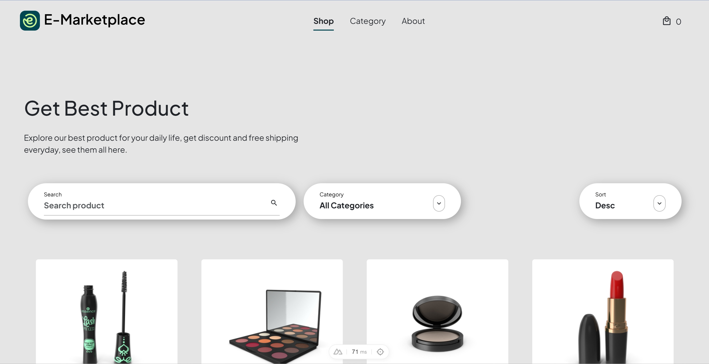

# Technical Test : Tri

Technical test for : Evermos

## Features

- Responsive
- SEO
- Cross platform

## Tech Stack

**Client:** NuxtJS, VueJS, Bootstrap

**Server:** Nitro,External API

## Run Locally

Clone the project

```bash
  git clone <gitlab https>
```

Go to the project directory

```bash
  cd evermos-technical-test
```

Install dependencies

```bash
  npm install
```

## Installation

Add .env in your local enviroment

```bash
  APP_API_URL="https://dummyjson.com"
```

Start the server

```bash
  npm run dev
```

## Demo

<a href="https://evermos-triputra.netlify.app">Demo</a>


